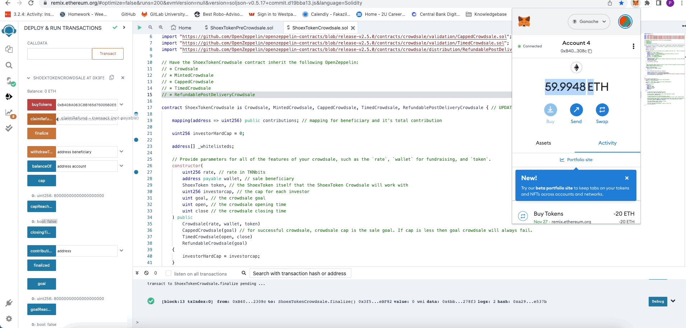

# ShoeX ~ICO 👟


[](https://www.canva.com/design/DAFSkN3Skvk/r_mWnVFkyoZ9kC4BecCgPA/view?utm_content=DAFSkN3Skvk&utm_campaign=designshare&utm_medium=link2&utm_source=sharebutton)


#### Team Name: The-Great-Pretenders

.png)


## Project Overview - Tokenising High-End Sneakers

Shoe flipping is a profitable business. The Sneaky coin will act as a digital token that allows individuals and organisations to exchange value backed by rare physical sneaker collections. 

The tokens will operate as part of a secure blockchain ledger that provides utility tethered closely to the sneaker stock. The token will be backed by the sneakers and pegged loosely to the collection's value. This electronic tokenisation will allow the fractional ownership of expensive shoe collections available on the open market using modern Financial Technology.


## Features

- **Tokenised Sneaker Ownership** ERC-20 Token on Ethereum Blockchain
- **Machine Learning Driven Algorithms** Data-driven analysis for decision-making using ML
- **Easy to Use Frontend** Interact directly with the blockchain with an intuitive User Interface


### Introduction - Sneaky Coin


Blockchains and Distributed Ledger Technology have proven to be successful at tokenising real-world assets. 

We can now take previously indivisible assets and fractionalise the network's stake.

The digitisation of assets such as Real- Estate and Gold, using smart contracts and blockchains, significantly benefits the users. Moreover, the tokens are divisible into more affordable units with additional utility.

The User can now participate in the high-end sneaker game without spending time, money and effort to find, buy and then secure the physical sneakers.


---


## Detailed Usage - Buying the ERC-20 Tokens

Initially the token will be hosted on the Ethereum Network as a Solidity Smart Contract. Users will need sufficient ETH for the transaction (Including Gas Fees) using their preffered wallet. Sufficient testing has been conducted on a local ETH testnet as detailed below.


### Presale

ShoeX will conduct a Presale to raise funds directly on the Ethereum blockchain. ShoeX will sell digital ERC-20 tokens called Sneaky Coins to raise capital for initial inventory and warehousing. Presale is open only to the whitelisted investors who sign up through our KYC portal.


### Crowdsale 

The second round of funding will come from a Crowdsale (ICO). The public ICO wil also offer investors the option of withdrawing their funds if the funding goal is not met. Furthermore, the ICO will be capped at the investor level, e.g. no investor can buy more than 100 tokens to ensure a fair distribution.

The benefit of the ERC-20 standard will be that tokens are immutable,  transparent, and tradable in a peer-to-peer fashion. In addition, the tokens can be self custodied and stored in a hardware wallet for safekeeping.


---


# User Instructions


## Back End deployment

To run the solidity code in Remix, please complie the solution files and follow the steps below gif for the deployment of the crowdsale contracts.


## Back End - Crowsale workflow Demo


### Stage 1 - Presale


Presale is open only for whitelisted investors, where tokens are offered at a better rate. The gif below describes buying tokens during the presale.


### Stage 2 - Public ICO

The gif below describes buying tokens during a public ICO.


### Stage 2.1 - ICO Raise Not Funded
    
The gif below shows finalising post-delivery refundable crowdsale when the goal is not met. In this scenario, investors can withdraw their money.




## Front End - Buying Tokens 

Interacting with The Front End on Streamlit

### Crowdsale

Whitelisted addresses can select their account and select an amount to purchase.

Additional information is available on the sidebar including the "Rate" of ETH/SHX Token and the "Total ETH Raised"


### Email Capture

Allows a user to stay up to date with the latest information. 

The captured information will be stored in the Resources folder in a CSV


### Whitepaper

Link for more information regarding the token economics (tokenomics) and allocation of funds.

User redirected to the active github repo for the whitepaper.


---


## Back End - Tokenisation

The ERC-20 code was written in Solidity, a smart-contract language on Ethereum.

```
pragma solidity ^0.5.17;
```

Tools used were:

- [Ganache](https://trufflesuite.com/ganache/)  to access the ETH test-net

- [Remix IDE](https://remix.ethereum.org/) was leveraged to create, compile and deploy the ERC-20 token.

- [Open Zeppelin](https://docs.openzeppelin.com/contracts/4.x/wizard) was used for the token contract templates.

    - <details>
      <summary>   Click to expand:</summary>

    ```sol

     $ Crowdsale

    import "https://github.com/OpenZeppelin/openzeppelin-contracts/blob/release-v2.5.0/contracts/crowdsale/Crowdsale.sol";
    import "https://github.com/OpenZeppelin/openzeppelin-contracts/blob/release-v2.5.0/contracts/crowdsale/emission/MintedCrowdsale.sol";
    import "https://github.com/OpenZeppelin/openzeppelin-contracts/blob/release-v2.5.0/contracts/crowdsale/validation/CappedCrowdsale.sol";
    import "https://github.com/OpenZeppelin/openzeppelin-contracts/blob/release-v2.5.0/contracts/crowdsale/validation/TimedCrowdsale.sol";
    import "https://github.com/OpenZeppelin/openzeppelin-contracts/blob/release-v2.5.0/contracts/crowdsale/distribution/RefundablePostDeliveryCrowdsale.sol";

      $ ERC-20

    import "https://github.com/OpenZeppelin/openzeppelin-contracts/blob/release-v2.5.0/contracts/token/ERC20/ERC20.sol";
    import "https://github.com/OpenZeppelin/openzeppelin-contracts/blob/release-v2.5.0/contracts/token/ERC20/ERC20Detailed.sol";
    import "https://github.com/OpenZeppelin/openzeppelin-contracts/blob/release-v2.5.0/contracts/token/ERC20/ERC20Mintable.sol";
    ```
    </details>

- [MetaMask](https://metamask.io/) wallet for interacting with test net and signing transactions.


## Interacting with the Backend

To run the code on your local machine, please follow the below steps:

1 Download the GitHub repo using ```git clone git@github.com:DIsaacman/Shoex.git```

2 Open Remix IDE and upload the three ```.sol``` files in the contracts folder 


3 Open Ganache and ensure MetaMask is installed and active

4 Compile the Contracts in Remix-IDE 


5 Copy The ABI and save/overwrite to backend/contracts/compiled using the same names 


6 Deploy the ShoeX Token Presale and Crowdsale (ShoexTokenPreCrowdsaleDeployer)

7 Parse in the input parameters, including token name and token rate, with Remix Deployer

8 Copy the contract addresses of Presale and Crowdsale

9 Insert the addresses into a .env file using the syntax

```env
MNEMONIC = "(insert 12 word keyphrase)"
WEB3_PROVIDER_URI= "http://127.0.0.1:7545"
PRE_SALE_SMART_CONTRACT_ADDRESS= "(insert)"
PRE_TOKEN_CONTRACT_ADDRESS= "(insert)"
SALE_SMART_CONTRACT_ADDRESS= "(insert)"
SALE_TOKEN_CONTRACT_ADDRESS= "(insert)"
```
10 Launch AdminApp.py 

```bash
streamlit run adminApp.py```


---


## Analysis

### Data Analysis & Machine Learning


To ensure that the sneaker investments are profitable, we used ML and Data analysis to create models and guidelines for buying Sneakers. 

The best shoe sizes for a profitable return are between 9-11, as shown below.


The Data was sourced from StockX CSV, a collection of 10,000 shoe sales over three years.

Python version 3.7 and Sci-Kit-Learn (```sklearn```) were the main tools used to create a KNN and Logistic regression model to determine if a shoe would meet profitability criteria.

<details>
  <summary>Click to expand:</summary>
  
```python
# Modules
import pandas as pd
import numpy as np
import seaborn as sns
import matplotlib.pyplot as plt
import matplotlib.ticker as plticker

# Import libraries for metrics
from sklearn.metrics import balanced_accuracy_score
from sklearn.metrics import confusion_matrix
from imblearn.metrics import classification_report_imbalanced
from sklearn.metrics import classification_report 
from sklearn import metrics

# Import Models
from sklearn.model_selection import train_test_split
from imblearn.over_sampling import RandomOverSampler
from sklearn.linear_model import LogisticRegression
from sklearn.neighbors import KNeighborsClassifier

import warnings
warnings.filterwarnings('ignore')
```
</details>

The code below created a profitability column based on if the profit of the shoe was at least 100%. The Boolean value was then converted into a binary integer used as a target in the Machine Learning model.

The Data was trained, tested and split before having several models applied. Oversampling the Data resulted in better accuracy scores to predict if the shoe would be profitable.

In the future, the model will be fitted with higher-quality data as part of the ongoing improvement of the project.


```
#Set Profit Margin as a multiple
margin = 1

# Find Profitable Sales and Create New Column Called Profitable to act as a target
df['Profitable'] = (df['%']>= margin )

# Change the bool value to an integer
df['Profitable'] = df['Profitable'].astype(int)
```

---


## Roadmap


