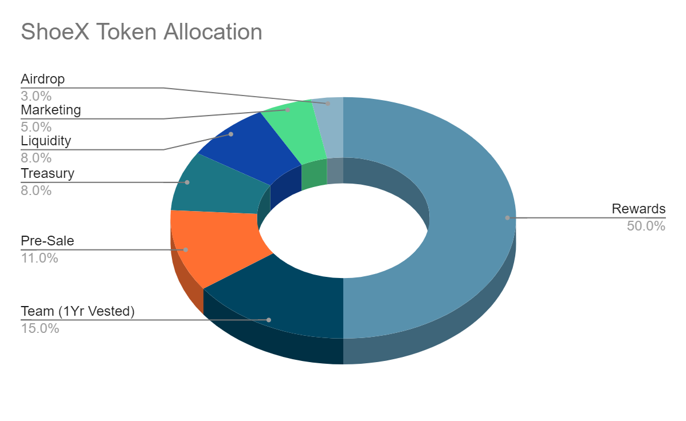

# ShoeX
## The Sneaky Token
### Democratising High-End Sneaker Ownership

.png)

## Digital Sneaker-Freakz
### Tokenomics and Roadmap for the Sneaky Coin

# Version Control

| Contribution  | Date          | Version|
| ------------- |:-------------:| -----: |
| GitHub        | 23/11/2022    | v0.2   |
|               |               |        |
|               |               |        |

---

# Abstract

Shoe flipping is a profitable business [^1][^2][^3]. The Sneaky coin will act as a digital token that allows individuals and organisations to exchange value backed by rare physical sneaker collections. 

The tokens will operate as part of a secure blockchain ledger that tracks and audits the sneaker stock. The token will be backed by the sneakers and pegged loosely to the collection's value. This electronic tokenisation will allow the fractional ownership of expensive shoe collections on the open market.

SneakX will be the platform that will launch the crowd sale. SneakX has published a roadmap below that indicates that each shoe pair will eventually exist as a unique NFT token that can be purchased with Sneaky coins for storing inventory or personal, physical delivery.

---
## Introduction

Blockchains and Distributed Ledger Technology have proven to be successful at tokenising real-world assets. 

We can now take previously indivisible assets and fractionalize the network's stake.

Assets such as Real Estate and Gold have been successfully tokenised using blockchain technology [^4][^5]. The digitisation of the assets using smart-contracts significantly benefits the users. Moreover, the tokens are divisible into more affordable units with additional utility.

You can now participate in the high-end sneaker game without spending time, money and effort to find, buy and then secure the physical sneakers.

---

## Roadmap

---

##Tokenomics

### The ICO (Initial Coin Offer)

ShoeX will conduct a Pre-Sale to raise funds directly on the Ethereum blockchain as a Crowdsale smart contract in Solidity.

In addition, ShoeX will sell digital ERC-20 tokens called Sneaky Coins to raise capital to invest in the sneaker collateral.

The benefit of the ERC-20 standard will be that tokens are immutable,  transparent, and tradable in a peer-to-peer fashion [^6][^7][^8]. The tokens can be self custodied and stored in a hardware wallet for safekeeping.

The coin does not aim to be a security and should not be considered a way to make money. Therefore, there is no promise of future gain or return, and investing in the token carries significant risks. The tokens will be linked to the inventory. As the inventory grows, so too will the number of tokens.

If the token threshold is not met, funds will be promptly returned to the buyers minus the gas fees associated.

Eventually, the token utility will allow the holder to purchase the sneakers directly through the ShoeX service of direct delivery or the custodianship model. The custodian model will give the user rights to the shoe stored and protected by ShoeX.

---

Token Distribution

The total supply will vary based on a multiple of the underlying asset. 

It is estimated that there will be a standard of 3% token inflation per year with slight variability based on the current inventory. 

Initially, there will be 500,000,000 Sneaky Coins. The total supply will be primarily used as rewards to attract early customers with all pre-sale crowd sale funds for the initial setup of the ShoeX business.

---

[^1]: Sneaker Flipping- https://www.sidehustlenation.com/sneaker-flipping-reselling-shoes/ 
[^2]: Sneaker Selling Tutorials - https://sneakerflippers.com/ 
[^3]: State of Sneakers https://huddleup.substack.com/p/the-state-of-sneakers-in-2022
[^4]: Digital Token Backed By Gold - https://paxos.com/paxgold/ 
[^5]: Tether Token Backed By USD - https://tether.to/en/transparency/ 
[^6]: ERC-20 Standard - https://ethereum.org/en/developers/docs/standards/tokens/erc-20/#top
[^7]: EIP-20 https://eips.ethereum.org/EIPS/eip-20 
[^8]: What are ERC-20 Tokens - https://www.investopedia.com/news/what-erc20-and-what-does-it-mean-ethereum/ 
